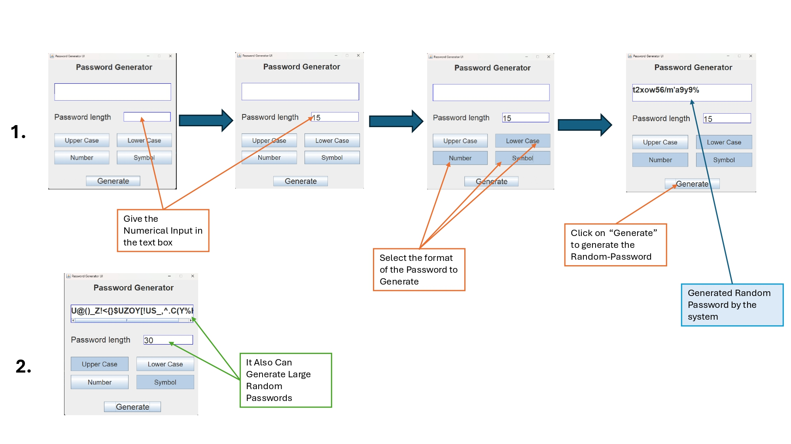

Random Password Generator (Java GUI) 🔐

 📌 Overview  
The Random Password Generator  is a Java-based GUI application that generates secure and random passwords with customizable length and character types. This project uses Swing for the graphical interface and Java's Random class for password generation.

🚀 Features  
- ✅ Customizable Password Length**  
- ✅ Includes Uppercase, Lowercase, Numbers, and Special Characters**  
- ✅ Copy to Clipboard Functionality**  
- ✅ User-Friendly GUI with Java Swing**  

🛠️ Tech Stack  
- Java (JDK 8 or later)  
- Swing (GUI Framework)  

  Installation & Usage
  Clone the Repository  
  git clone https://github.com/tarunkumarsagar/Random-password-generator-GUI.git

How It Works
The app generates a random password based on selected options.
Users can specify password length and character sets.
The generated password can be copied to the clipboard for easy use.
   

